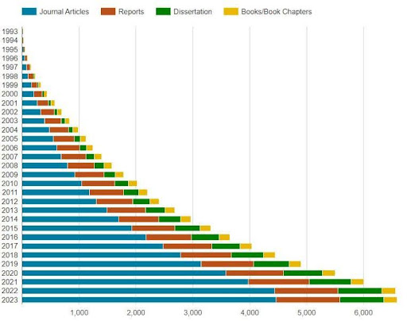

<!-- Chapter 1 Introduction -->

#  Chapter 1. Introduction

### Our goal with this guide

The Health and Retirement Study (HRS), started in 1990 by Congress, is a key source for
researching significant trends, especially as the U.S. population ages and baby boomers retire. It
helps us understand retirement, health, and life changes as we age. The HRS is a large and
complex study, but the basic design is a survey that:

- Is nationally representative of the population over age 50
- Follows individuals and their spouses or partners from the time of their entry into the
survey until death
- Maintains a steady state design by introducing a new 6-year birth cohort of
participants every 6 years
- Is highly multidisciplinary

HRS is a comprehensive resource that covers various aging-related topics. For over two
decades, it has been used by researchers and policymakers to explore a wide array of questions
about aging, from how personality affects retirement savings to the impact of health events on
dementia. The HRS aims to analyze these issues and how changes, like shifts in retirement
planning, influence the elderly.

HRS has two main goals: to gather important data about aging and to make it available to the
public. The use of HRS data by researchers is expanding, leading to a surge in related academic
publications, as seen in Figure 1.

 

 

Figure 1. Publications using HRS data by type 1993-2023
Our goal with this guide is to provide new users with the tools they need to get started using
the data.

### Visit the website (hrs.isr.umich.edu)

The HRS website is extensive and may be difficult for newcomers to use. This guide is meant to be used alongside the website. It will direct you to specific parts of the site, each time starting from one of the main links on the HRS homepage: 

<!-- TO DO: apply stylesheet across all text with endlines -->

About \
Documentation \
Data Products \
Media & Publications \
We also provide important highlights from each of these homepage links in [Chapter 6: Using the Website].

This guide is both a reference for the data and helps users at different stages. It highlights sections that are helpful for beginners and offers additional support as you become more experienced with the data.

### HRS original data and RAND HRS products

It is crucial to differentiate between the original HRS data and the more accessible RAND HRS data. The original HRS data come from interviews and are processed for use on the HRS website, but they may be complex for new users. Therefore, the RAND Corporation simplifies these data into user-friendly products, detailed in [Chapter 4] and summarized in [Figure 5]. However, it's also important to learn how to use the original HRS data, as not everything is included in the RAND  
New users often start with the [RAND Longitudinal File], a simpler format of the HRS data that combines information from multiple survey sections and waves of data. 

### The all-important Tracker File

The HRS Cross-wave Tracker File is crucial for new users. It helps track individual participants and their interview details across different survey waves, providing basic demographics, interview statuses, and cross-sectional weights for each eligible respondent  

As a complement to the Getting Stared Guide, we strongly recommend spending some time reading the [data description for the Tracker file].  

In addition to this Guide, we advise reading the [Tracker file data description], which gives more detail about its structure and variables. While there's some content overlap, the description includes additional information that could be valuable later on. More about the Tracker file can be found in [Chapter 7 on Data Management]. As you start using the HRS, the [Cohort Profile] is a useful overview of the study, accessible via our online bibliography.  

Sonnega A, Faul J, Ofstedal MBeth, Langa KM, Phillips JWR, Weir DR. Cohort Profile: the Health and Retirement Study (HRS). Int J Epidemiol. 2014;43(2):576-85

[//]: # (links within document)
[Chapter 6: Using the Website]: <../chapter-2/hrs2.md>
[Chapter 4]: <../chapter-2/hrs2.md>
[Figure 5]: <../chapter-2/hrs2.md>
[Chapter 7 on Data Management]: <../chapter-2/hrs2.md>

[//]: # (links to the website)
[RAND Longitudinal File]: <https://hrs.isr.umich.edu/>
[data description for the Tracker file]: <https://hrs.isr.umich.edu/>
[Tracker file data description]:  <https://hrs.isr.umich.edu/>
[Cohort Profile]: <https://hrs.isr.umich.edu/>

